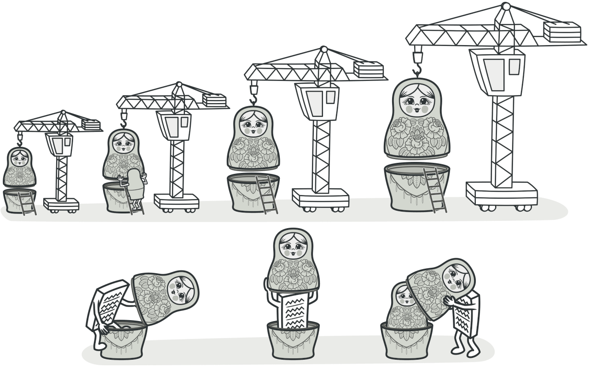

# Santiago Coffee Shop

Welcome to the Santiago Coffee Shop project! This project is built with **Spring Boot** and demonstrates a variety of software design techniques, including the **Decorator Pattern**.


Ref: https://refactoring.guru/design-patterns/decorator

## Overview

This application simulates a simple coffee shop scenario where users can:

1. **Select** a Base Beverage
2. **Optionally** Enhance it with one or more Toppings

We expose a REST API via Spring Boot to place orders for beverages and add toppings (such as `LATTE` or `CHOCOLATE`).

---

## How the Decorator Pattern is Implemented

### 1. The `Beverage` Interface

All beverages (like `Espresso` or `Americano`) implement a simple interface:

```java
public interface Beverage {
  String getDescription();
  double getPrice();
}
```

This interface defines the core contract for any beverage–a description and a price.

### 2. The `BeverageDecorator` Abstract Class

`BeverageDecorator` is an abstract class that also implements `Beverage`. It holds a reference to a `Beverage` object internally (the component being decorated). This allows decorators to:

- Forward calls to the wrapped `Beverage`.
- Add their own extra behavior (e.g., additional cost, descriptive text).

```java
public abstract class BeverageDecorator implements Beverage {
  protected Beverage beverage;

  public BeverageDecorator(Beverage beverage) {
    this.beverage = beverage;
  }

  @Override
  public String getDescription() {
    return beverage.getDescription();
  }

  @Override
  public double getPrice() {
    return beverage.getPrice();
  }
}
```

### 3. The `ToppingDecorator`

It receives a `ToppingTypeEnum` that determines the topping’s price and text. For each topping applied, it wraps the existing `Beverage` in another decorator:

```java
public class ToppingDecorator extends BeverageDecorator {
  private final ToppingTypeEnum toppingType;

  public ToppingDecorator(Beverage beverage, ToppingTypeEnum toppingType) {
    super(beverage);
    this.toppingType = toppingType;
  }

  @Override
  public double getPrice() {
    return beverage.getPrice() + toppingType.getPrice();
  }

  @Override
  public String getDescription() {
    return beverage.getDescription() + " + " + toppingType.name();
  }
}
```

### 4. Storing Topping Prices via an `enum`

To avoid hardcoding the same logic in multiple classes, we store topping prices within the `ToppingTypeEnum`. Each topping in the enum has its own price:

```java
public enum ToppingTypeEnum {
    LATTE(0.9),
    CHOCOLATE(1.5);

    private final double price;

    ToppingTypeEnum(double price) {
        this.price = price;
    }

    public double getPrice() {
        return price;
    }
}
```

### 5. Factory Methods to Create Beverages and Apply Toppings

`BeverageFactory` contains static methods to build our `Beverage` objects. For multiple toppings, we pass a list to the `addToppings` method, which applies a new `ToppingDecorator` for each topping in turn:

```java
  public static Beverage addToppings(Beverage beverage, List<ToppingTypeEnum> toppings) {
      if (toppings == null) {
          return beverage;
      }
      for (ToppingTypeEnum topping : toppings) {
          beverage = new ToppingDecorator(beverage, topping);
      }
      return beverage;
  }
```

This method stacks each topping around the core `Beverage`.

### 6. Request Handling in the `OrderService`

When an order is placed, we build the base `Beverage`, then apply any toppings specified. With multiple toppings, each topping is successively wrapped around the beverage:

```java
Beverage beverage = BeverageFactory.createBeverage(orderItem.getItem());
beverage = BeverageFactory.addToppings(beverage, orderItem.getToppings());
```

Finally, we calculate the total price and build a description that includes all selected toppings.

This approach allows us to:

- Dynamically add or remove toppings without modifying existing code.
- Keep the core `Beverage` class clean and focused on its core responsibilities.
- Easily extend the system with new decorators or beverages.

---

## Project Structure

- **`controller`**: Contains REST controllers handling API calls.
- **`service`**: Contains service classes like `OrderService` where the logic to build orders is performed.
- **`factory`**: Houses the `BeverageFactory` responsible for creating and layering beverages and toppings.
- **`entity/beverage`**: Contains concrete beverage classes (e.g., `Espresso`, `Americano`).
- **`entity/beverageDecorator`**: Contains the decorator classes, including the abstract `BeverageDecorator` and `ToppingDecorator`.
- **`enums`**: Holds enumerations for beverage and topping definitions (plus pricing).
- **`test`**: Contains unit tests and integration tests.

---

## Running the Application

1. **Install Dependencies**  
   Make sure you have Java 17 or later installed.
2. **Run Locally**  
   From your project directory:
   ```
   ./gradlew bootRun
   ```
3. **API Endpoints**
   - `POST /orders`  
     Accepts an `OrderRequestDTO` containing:
     - `tableNumber`
     - A list of `OrderItemRequestDTO`, each containing:
       - A `BeverageTypeEnum` (e.g., `AMERICANO` or `ESPRESSO`)
       - A list of `ToppingTypeEnum` (e.g., `[LATTE, CHOCOLATE]`)

---

## Testing the Decorator Logic

We add toppings to a beverage by creating an order with multiple topping types in the request. The tests in `OrderServiceTest` confirm:

- The **description** is properly appended with each topping.
- The **price** of the beverage is increased according to the selected toppings.

For example, an order of one `AMERICANO` base plus `[CHOCOLATE, LATTE]` yields a description `Americano + CHOCOLATE + LATTE` and price `3.00 + 1.5 + 0.9 = 5.40`.

---

## License

This project is provided under the [Apache License 2.0](https://www.apache.org/licenses/LICENSE-2.0), which you can find in the root directory of this repository.

---

Feel free to explore or modify the project! If you have any questions, open an issue or reach out to the maintainers. We hope this example helps you understand and implement the **Decorator Pattern** effectively in your own projects.
